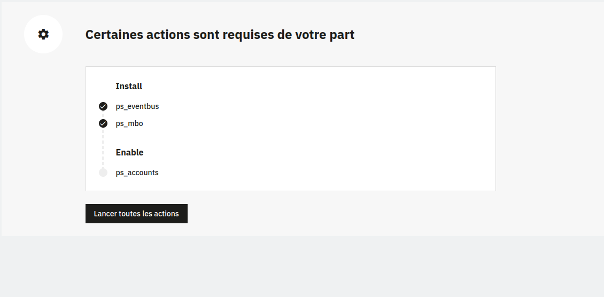

# PrestaShop module dependencies library

The goal of this package is to help managing module dependencies.

Let's explain it with an actual case

Supposing our module needs modules A and B to work properly.

We will have to install this `module-lib-mbo-installer` and have a file named `module_dependencies.json` in the root folder of our module containing

```
{
    "dependencies": [
      {
        "name" : "A"
      },
      {
        "name" : "B"
      }
    ]
}
```

The lib will start by checking if [PS MBO (Marketplace in the Back Office)](https://github.com/PrestaShopCorp/ps_mbo) is installed and enabled.

MBO needs to be installed first because we download other modules from the marketplace.

Then it will check for the modules A and B

## Installation

```
composer require prestashop/module-lib-mbo-installer
```

## Version Guidance

| Version | Status         | Packagist           -| Namespace    | Repo                | Docs                | PHP Version  |
|---------|----------------|----------------------|--------------|---------------------|---------------------|--------------|
| 1.x     | Latest         | `prestashop/module-lib-mbo-installer` | `Prestashop\ModuleLibMboInstaller` | [v1.x][lib-1-repo] | N/A                 | >=5.6   |

[lib-1-repo]: https://github.com/PrestaShopCorp/module-lib-mbo-installer/tree/main

## Usage

You have 2 methods available

- DependenciesBuilder::handleDependencies() : this method will return you the status of all the dependencies, including MBO, in an array

```php
[
    'module_display_name' => string // your displayed module name 
    'module_name' => string // your module tech name
    'module_version' => string
    'ps_version' => string
    'php_version' => string
    'locale' => string // the shop locale
    'dependencies' => [ // an array of all the dependencies defined + MBO
        [
            'name' => 'ps_mbo'
            'installed' => bool
            'enabled' => bool
            'current_version' => string
            'install' => string // route to install the module, if relevant
            'enable' => string  // route to enable the module, if relevant
            'upgrade' => string  // route to upgrade the module, if relevant
        ],
        [
            'name' => string // a dependent module
            'installed' => bool
            'enabled' => bool
            'current_version' => string
            'install' => string // route to install the module, if relevant
            'enable' => string  // route to enable the module, if relevant
            'upgrade' => string  // route to upgrade the module, if relevant
        ],
        ...
    ]
];
```

- DependenciesBuilder::areDependenciesMet() : this method will return you whether all the dependencies, including MBO, are installed and enabled


These 2 methods will help you gather informations about your dependencies and allow you to perform actions to resolve them.

### Examples of implementation

In most of the cases you'll want to show the dependencies of your module in the configuration page, to allow the "user" to fix them

You can use one of the examples above in the `getContent` method of your module's main file

#### Use the given public CDC

In your module
```php
$mboInstaller = new Prestashop\ModuleLibMboInstaller\DependencyBuilder($this);
$dependencies = $mboInstaller->handleDependencies();

$this->smarty->assign('dependencies', $dependencies);

return $this->display(__FILE__, 'views/templates/admin/dependency_builder.tpl');
```

In the template
```html
<!-- Load cdc library -->
<script src="https://assets.prestashop3.com/dst/mbo/v1/mbo-cdc-dependencies-resolver.umd.js"></script>

<!-- cdc container -->
<div id="cdc-container"></div>

<script defer>
  const renderMboCdcDependencyResolver = window.mboCdcDependencyResolver.render
  const context = {
    ...{$dependencies|json_encode},
    onDependenciesResolved: () => console.log('Everything works!'),
    onDependencyResolved: (dependencyData) => console.log('Dependency installed', dependencyData), // name, displayName, version
    onDependencyFailed: (dependencyData) => console.log('Failed to install dependency', dependencyData),
    onDependenciesFailed: () => console.log('There are some errors'),
  }
  renderMboCdcDependencyResolver(context, '#cdc-container')
</script>
```

This example uses our public CDC which will display a page with the status of the dependencies and an action button to resolve them all




#### Do it yourself

In your module
```php
$mboInstaller = new Prestashop\ModuleLibMboInstaller\DependencyBuilder($this);
$dependencies = $mboInstaller->handleDependencies();

return $this->render(
    '@Modules/examplemodule/views/templates/admin/dependency_builder.html.twig',
    [
        'dependencies' => $dependencies,
    ]
);
```

In the template
```js
<script>
    $(document).on('click', '.module_action', function(event) {
        event.preventDefault();
        const moduleName = window.$(this).attr('data-module')
        window.$.ajax({
            method: 'POST',
            url: window.$(this).attr('data-url'),
        }).done((response) => {
            console.log(response[moduleName])
            if (response[moduleName].status === true) {
                window.$.growl.notice({message: response[moduleName].msg});
                window.location.reload();
            } else {
                window.$.growl.error({message: response[moduleName].msg});
            }
        });
    })
</script>
```

```twig

    <div>
        {{ dependency.name }} : 
        
            OK
        
            <a class="btn btn-primary module_action" href="#" data-module="{{ dependency.name }}" data-url="{{ dependency.install }}">
              Install
            </a>
        
            <a class="btn btn-primary module_action" href="#" data-module="{{ dependency.name }}" data-url="{{ dependency.enable }}">
              Enable
            </a>
        
            NOK
        
    </div>

```